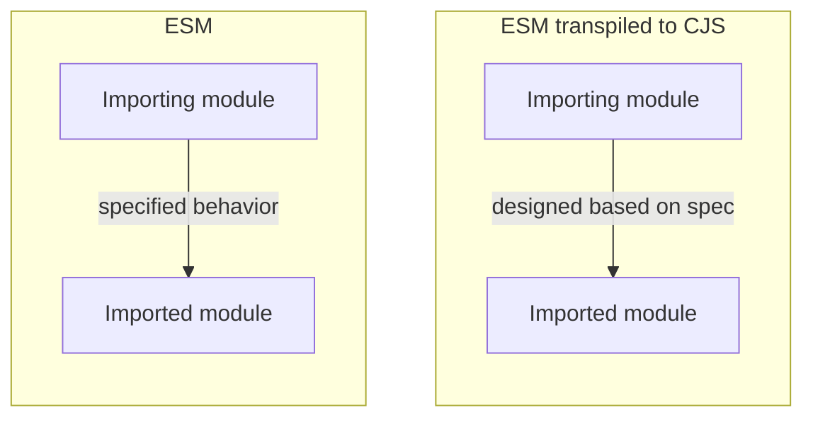

## Module emit and checking

### ESM/CJS Interoperability

It’s 2015, and you’re writing an ESM-to-CJS transpiler. There’s no specification for how to do this; all you have is a specification of how ES modules are supposed to interact with each other, knowledge of how CommonJS modules interact with each other, and a knack for figuring things out. Consider an exporting ES module:

```ts
export const A = {};
export const B = {};
export default "Hello, world!";
```

How would you turn this into a CommonJS module? Recalling that default exports are just named exports with special syntax, there seems to be only one choice:

```ts
module.exports.A = {};
module.exports.B = {};
module.exports.default = "Hello, world!";
```

This is a nice analog, and it lets you implement a similar on the importing side:

```ts
import hello, { A, B } from "./module";
console.log(hello, A, B);

// transpiles to:

const module_1 = require("./module");
console.log(module_1.default, module_1.A, module_1.B);
```

So far, everything in CJS-world matches up one-to-one with everything in ESM-world. Extending the equivalence above one step further, we can see that we also have:

```ts
import * as mod from "./module";
console.log(mod.default, mod.A, mod.B);

// transpiles to:

const mod = require("./module");
console.log(mod.default, mod.A, mod.B);
```

You might notice that in this scheme, there’s no way to write an ESM export that produces an output where `module.exports` is assigned a function, class, or primitive:

```ts
// @Filename: exports-function.js
module.exports = function hello() {
  console.log("Hello, world!");
};
```

But existing CommonJS modules frequently take this form. How might an ESM import, processed with our transpiler, access this module? We just established that a namespace import (`import *`) transpiles to a plain `require` call, so we can support an input like:

```ts
import * as hello from "./exports-function";
hello();

// transpiles to:

const hello = require("./exports-function");
hello();
```

Our output works at runtime, but we have a compliance problem: according to the JavaScript specification, a namespace import always resolves to a [_Module Namespace Object_](https://tc39.es/ecma262/#sec-module-namespace-objects), that is, an object whose members are the exports of the module. In this case, `require` would return the function `hello`, but `import *` can never return a function. The correspondence we assumed appears invalid.

It’s worth taking a step back here and clarifying what the _goal_ is. As soon as modules landed in the ES2015 specification, transpilers emerged with support for downleveling ESM to CJS, allowing users to adopt the new syntax long before runtimes implemented support for it. There was even a sense that writing ESM code was a good way to “future-proof” new projects. For this to be true, there needed to be a seamless migration path from executing the transpilers’ CJS output to executing the ESM input natively once runtimes developed support for it. The goal was to find a way to downlevel ESM to CJS that would allow any or all of those transpiled outputs to be replaced by their inputs in a future runtime, with no observable change in behavior.

By following the specification, it was easy enough for transpilers to find a set of transformations that made the semantics of their transpiled CommonJS outputs match the specified semantics of their ESM inputs (arrows represent imports):



However, CommonJS modules (written as CommonJS, not as ESM transpiled to CommonJS) were already well-established in the Node ecosystem, so it was inevitable that modules written as ESM and transpiled to CJS would start “importing” modules written as CommonJS. The behavior for this interoperability, though, was not specified by ES2015, and didn’t yet exist in any real runtime.

```mermaid
graph TD
  subgraph Transpiled[ESM transpiled to CJS]
    C[Importing module] -- designed based on spec --> D[Imported module]
  end
  subgraph CJS[True CJS]
    E[Imported module]
  end
  subgraph ESM
    A[Importing module] -- specified behavior --> B[Imported module]
  end
  A -. unspecified behavior .-> E
  C .->|"<span style='font-size: 3em'>❓🤷🏻‍♂️❓</span>"| E
```



Even if transpiler authors did nothing, a behavior would emerge from the existing semantics between the `require` calls they emitted in transpiled code and the `module.exports` defined in existing CJS modules. And to allow users to transition seamlessly from transpiled ESM to true ESM once their runtime supported it, that behavior would have to match the one the runtime chose to implement.

Guessing what interop behavior runtimes would support wasn’t limited to ESM importing “true CJS” modules either. Whether ESM would be able to recognize ESM-transpiled-from-CJS as distinct from CJS, and whether CJS would be able to `require` ES modules, were also unspecified. Even whether ESM imports would use the same module resolution algorithm as CJS `require` calls was unknowable. All these variables would have to be predicted correctly in order to give transpiler users a seamless migration path toward native ESM.

#### `allowSyntheticDefaultImports` and `esModuleInterop`

Let’s return to our specification compliance problem, where `import *` transpiles to `require`:

```ts
// Invalid according to the spec:
import * as hello from "./exports-function";
hello();

// but the transpilation works:
const hello = require("./exports-function");
hello();
```

When TypeScript first added support for writing and transpiling ES modules, the compiler addressed this problem by issuing an error on any namespace import of a module whose `module.exports` was not a namespace-like object:

```ts
import * as hello from "./exports-function";
// TS2497              ^^^^^^^^^^^^^^^^^^^^
// External module '"./exports-function"' resolves to a non-module entity
// and cannot be imported using this construct.
```

The only workaround was for users to go back to using the older TypeScript import syntax representing a CommonJS `require`:

```ts
import hello = require("./exports-function");
```

Forcing users to revert to non-ESM syntax was essentially an admission that “we don’t know how or if a CJS module like `"./exports-function"` will be accessible with ESM imports in the future, but we know it _can’t_ be with `import *`, even though it will work at runtime in the transpilation scheme we’re using.” It doesn’t meet the goal of allowing this file to be migrated to real ESM without changes, but neither does the alternative of allowing the `import *` to link to a function. This is still the behavior in TypeScript today when `allowSyntheticDefaultImports` and `esModuleInterop` are disabled.

Meanwhile, other transpilers were trying to solve the same problem. The thought process went something like this:

1. To import a CJS module that exports a function or a primitive, we clearly need to use a default import. A namespace import would be illegal, and named imports don’t make sense here.
2. Most likely, this means that runtimes implementing ESM/CJS interop will choose to make default imports of CJS modules _always_ link directly to the whole `module.exports`, rather than only doing so if the `module.exports` is a function or primitive.
3. So, a default import of a true CJS module should work just like a `require` call. But we’ll need a way to disambiguate true CJS modules from our transpiled CJS modules, so we can still transpile `export default "hello"` to `module.exports.default = "hello"` and have a default import of _that_ module link to `module.exports.default`. Basically, a default import of one of our own transpiled modules needs to work one way (to simulate ESM-to-ESM imports), while a default import of any other existing CJS module needs to work another way (to simulate how we think ESM-to-CJS imports will work).
4. When we transpile an ES module to CJS, let’s add a special extra field to the output:
   ```ts
   module.exports.A = {};
   module.exports.B = {};
   module.exports.default = "Hello, world!";
   // Extra special flag!
   module.exports.__esModule = true;
   ```
   that we can check for when we transpile a default import:
   ```ts
   // import hello from "./modue";
   const _mod = require("./module");
   const hello = _mod.__esModule ? _mod.default : _mod;
   ```

<!--


Fairly quickly, transpilers more or less converged on a consensus interop strategy, which (spoiler alert) turned out not to be a very close match for the interop strategy implemented by Node when it released support for ESM in v12. However, the consensus strategy continues to be used by transpilers, bundlers, experimental Node loaders, and some other runtimes.

---

Unfortunately, this is TypeScript’s default behavior—the behavior when `esModuleInterop` is disabled. To sidestep the `import *` specification compliance issue, TypeScript simply issues an error on namespace imports when the target module’s `module.exports` is not a namespace-like object:

```ts
import * as hello from "./exports-function";
// TS2497              ^^^^^^^^^^^^^^^^^^^^
// Original message:
//   External module '"./exports-function"' resolves to a non-module entity
//   and cannot be imported using this construct.
// Today’s message:
//   This module can only be referenced with ECMAScript imports/exports by
//   turning on the 'esModuleInterop' flag and referencing its default export.
```

https://github.com/babel/babel/issues/493
https://github.com/babel/babel/issues/95
https://github.com/nodejs/node/pull/16675
https://github.com/google/traceur-compiler/pull/785#issuecomment-35633727
https://github.com/microsoft/TypeScript/pull/2460

-->