# ESM/CJS Interoperability

It’s 2015, and you’re writing an ESM-to-CJS transpiler. There’s no specification for how to do this; all you have is a specification of how ES modules are supposed to interact with each other, knowledge of how CommonJS modules interact with each other, and a knack for figuring things out. Consider an exporting ES module:

```ts
export const A = {};
export const B = {};
export default "Hello, world!";
```

How would you turn this into a CommonJS module? Recalling that default exports are just named exports with special syntax, there seems to be only one choice:

```ts
exports.A = {};
exports.B = {};
exports.default = "Hello, world!";
```

This is a nice analog, and it lets you implement a similar on the importing side:

```ts
import hello, { A, B } from "./module";
console.log(hello, A, B);

// transpiles to:

const module_1 = require("./module");
console.log(module_1.default, module_1.A, module_1.B);
```

So far, everything in CJS-world matches up one-to-one with everything in ESM-world. Extending the equivalence above one step further, we can see that we also have:

```ts
import * as mod from "./module";
console.log(mod.default, mod.A, mod.B);

// transpiles to:

const mod = require("./module");
console.log(mod.default, mod.A, mod.B);
```

You might notice that in this scheme, there’s no way to write an ESM export that produces an output where `exports` is assigned a function, class, or primitive:

```ts
// @Filename: exports-function.js
exports = function hello() {
  console.log("Hello, world!");
};
```

But existing CommonJS modules frequently take this form. How might an ESM import, processed with our transpiler, access this module? We just established that a namespace import (`import *`) transpiles to a plain `require` call, so we can support an input like:

```ts
import * as hello from "./exports-function";
hello();

// transpiles to:

const hello = require("./exports-function");
hello();
```

Our output works at runtime, but we have a compliance problem: according to the JavaScript specification, a namespace import always resolves to a [_Module Namespace Object_](https://tc39.es/ecma262/#sec-module-namespace-objects), that is, an object whose members are the exports of the module. In this case, `require` would return the function `hello`, but `import *` can never return a function. The correspondence we assumed appears invalid.

It’s worth taking a step back here and clarifying what the _goal_ is. As soon as modules landed in the ES2015 specification, transpilers emerged with support for downleveling ESM to CJS, allowing users to adopt the new syntax long before runtimes implemented support for it. There was even a sense that writing ESM code was a good way to “future-proof” new projects. For this to be true, there needed to be a seamless migration path from executing the transpilers’ CJS output to executing the ESM input natively once runtimes developed support for it. The goal was to find a way to downlevel ESM to CJS that would allow any or all of those transpiled outputs to be replaced by their inputs in a future runtime, with no observable change in behavior.

By following the specification, it was easy enough for transpilers to find a set of transformations that made the semantics of their transpiled CommonJS outputs match the specified semantics of their ESM inputs (arrows represent imports):


However, CommonJS modules (written as CommonJS, not as ESM transpiled to CommonJS) were already well-established in the Node ecosystem, so it was inevitable that modules written as ESM and transpiled to CJS would start “importing” modules written as CommonJS. The behavior for this interoperability, though, was not specified by ES2015, and didn’t yet exist in any real runtime.

```mermaid
graph TD
  subgraph Transpiled[ESM transpiled to CJS]
    C[Importing module] -- designed based on spec --> D[Imported module]
  end
  subgraph CJS[True CJS]
    E[Imported module]
  end
  subgraph ESM
    A[Importing module] -- specified behavior --> B[Imported module]
  end
  A -. unspecified behavior .-> E
  C .->|"<span style='font-size: 3em'>❓🤷🏻‍♂️❓</span>"| E
```



Even if transpiler authors did nothing, a behavior would emerge from the existing semantics between the `require` calls they emitted in transpiled code and the `exports` defined in existing CJS modules. And to allow users to transition seamlessly from transpiled ESM to true ESM once their runtime supported it, that behavior would have to match the one the runtime chose to implement.

Guessing what interop behavior runtimes would support wasn’t limited to ESM importing “true CJS” modules either. Whether ESM would be able to recognize ESM-transpiled-from-CJS as distinct from CJS, and whether CJS would be able to `require` ES modules, were also unspecified. Even whether ESM imports would use the same module resolution algorithm as CJS `require` calls was unknowable. All these variables would have to be predicted correctly in order to give transpiler users a seamless migration path toward native ESM.

## `allowSyntheticDefaultImports` and `esModuleInterop`

Let’s return to our specification compliance problem, where `import *` transpiles to `require`:

```ts
// Invalid according to the spec:
import * as hello from "./exports-function";
hello();

// but the transpilation works:
const hello = require("./exports-function");
hello();
```

When TypeScript first added support for writing and transpiling ES modules, the compiler addressed this problem by issuing an error on any namespace import of a module whose `exports` was not a namespace-like object:

```ts
import * as hello from "./exports-function";
// TS2497              ^^^^^^^^^^^^^^^^^^^^
// External module '"./exports-function"' resolves to a non-module entity
// and cannot be imported using this construct.
```

The only workaround was for users to go back to using the older TypeScript import syntax representing a CommonJS `require`:

```ts
import hello = require("./exports-function");
```

Forcing users to revert to non-ESM syntax was essentially an admission that “we don’t know how or if a CJS module like `"./exports-function"` will be accessible with ESM imports in the future, but we know it _can’t_ be with `import *`, even though it will work at runtime in the transpilation scheme we’re using.” It doesn’t meet the goal of allowing this file to be migrated to real ESM without changes, but neither does the alternative of allowing the `import *` to link to a function. This is still the behavior in TypeScript today when `allowSyntheticDefaultImports` and `esModuleInterop` are disabled.

> Unfortunately, this is a slight oversimplification—TypeScript didn’t fully avoid the compliance issue with this error, because it allowed namespace imports of functions to work, and retain their call signatures, as long as the function declaration merged with a namespace declaration—even if the namespace was empty. So while a module exporting a bare function was recognized as a “non-module entity”:
> ```ts
> declare function $(selector: string): any;
> export = $; // Cannot `import *` this 👍
> ```
> A should-be-meaningless change allowed the invalid import to type check without errors:
> ```ts
> declare namespace $ {}
> declare function $(selector: string): any;
> export = $; // Allowed to `import *` this and call it 😱
> ```

Meanwhile, other transpilers were coming up with a way to solve the same problem. The thought process went something like this:

1. To import a CJS module that exports a function or a primitive, we clearly need to use a default import. A namespace import would be illegal, and named imports don’t make sense here.
2. Most likely, this means that runtimes implementing ESM/CJS interop will choose to make default imports of CJS modules _always_ link directly to the whole `exports`, rather than only doing so if the `exports` is a function or primitive.
3. So, a default import of a true CJS module should work just like a `require` call. But we’ll need a way to disambiguate true CJS modules from our transpiled CJS modules, so we can still transpile `export default "hello"` to `exports.default = "hello"` and have a default import of _that_ module link to `exports.default`. Basically, a default import of one of our own transpiled modules needs to work one way (to simulate ESM-to-ESM imports), while a default import of any other existing CJS module needs to work another way (to simulate how we think ESM-to-CJS imports will work).
4. When we transpile an ES module to CJS, let’s add a special extra field to the output:
   ```ts
   exports.A = {};
   exports.B = {};
   exports.default = "Hello, world!";
   // Extra special flag!
   exports.__esModule = true;
   ```
   that we can check for when we transpile a default import:
   ```ts
   // import hello from "./modue";
   const _mod = require("./module");
   const hello = _mod.__esModule ? _mod.default : _mod;
   ```

The `__esModule` flag first appeared in Traceur, then in Babel, SystemJS, and Webpack shortly after. TypeScript added the `allowSyntheticDefaultImports` in 1.8 to allow the type checker to link default imports directly to the `exports`, rather than the `exports.default`, of any module types that lacked an `export default` declaration. The flag didn’t modify how imports or exports were emitted, but it allowed default imports to reflect how other transpilers would treat them. Namely, it allowed a default import to be used to resolve to “non-module entities,” where `import *` was an error:

```ts
// Error:
import * as hello from "./exports-function";

// Old workaround:
import hello = require("./exports-function");

// New way, with `allowSyntheticDefaultImports`:
import hello from "./exports-function";
```

This was usually enough to let Babel and Webpack users write code that already worked in those systems without TypeScript complaining, but it was only a partial solution, leaving a few issues unsolved:

1. Babel and others varied their default import behavior on whether an `__esModule` property was found on the target module, but `allowSyntheticDefaultImports` only enabled a _fallback_ behavior when no default export was found in the target module’s types. This created an inconsistency if the target module had an `__esModule` flag but _no_ default export. Transpilers and bundlers would still link a default import of such a module to its `exports.default`, which would be `undefined`, and would ideally be an error in TypeScript, since real ESM imports cause errors if they can’t be linked. But with `allowSyntheticDefaultImports`, TypeScript would think a default import of such an import links to the whole `exports` object, allowing named exports to be accessed as its properties.
2. `allowSyntheticDefaultImports` didn’t change how namespace imports were typed, creating an odd inconsistency where both could be used and would have the same type:
   ```ts
   // @Filename: exportEqualsObject.d.ts
   declare const obj: object;
   export = obj;

   // @Filename: main.ts
   import objDefault from "./exportEqualsObject";
   import * as objNamespace from "./exportEqualsObject";

   // This should be true at runtime, but TypeScript gives an error:
   objNamespace.default === objDefault;
   //           ^^^^^^^ Property 'default' does not exist on type 'typeof import("./exportEqualsObject")'.
   ```
3. Most importantly, `allowSyntheticDefaultImports` did not change the JavaScript emitted by `tsc`. So while the flag enabled more accurate checking as long as the code was fed into another tool like Babel or Webpack, it created a real danger for users who were emitting `--module commonjs` with `tsc` and running in Node. If they encountered an error with `import *`, it may have appeared as if enabling `allowSyntheticDefaultImports` would fix it, but in fact it only silenced the build-time error while emitting code that would crash in Node.

TypeScript introduced the `esModuleInterop` flag in 2.7, which refined the type checking of imports to address the remaining inconsistencies between TypeScript’s analysis and the interop behavior used in existing transpilers and bundlers, and critically, adopted the same `__esModule`-conditional CommonJS emit that transpilers had adopted years before. (Another new emit helper for `import *` ensured the result was always an object, with call signatures stripped, fully resolving the specification compliance issue that the aforementioned “resolves to a non-module entity” error didn’t quite sidestep.) Finally, with the new flag enabled, TypeScript’s type checking, TypeScript’s emit, and the rest of the transpiling and bundling ecosystem were in agreement on a CJS/ESM interop scheme that was spec-legal and, perhaps, plausibly adoptable by Node.

## Interop in Node

Node shipped support for ES modules unflagged in v12. Like the bundlers and transpilers began doing years before, Node gave CommonJS modules a “synthetic default export” of their `exports` object, allowing the entire module contents to be accessed with a default import from ESM:

```ts
// @Filename: export.cjs
exports = { hello: "world" };

// @Filename: import.mjs
import greeting from "./export.cjs";
greeting.hello; // "world"
```

That’s one win for seamless migration! Unfortunately, the similarities mostly end there.

### No `__esModule` detection (the “double default” problem)

Node wasn’t able to respect the `__esModule` marker to vary its default import behavior. So a transpiled module with a “default export” behaves one way when “imported” by another transpiled module, and another way when imported by a true ES module in Node:

```ts
// @Filename: node_modules/dependency/index.js
exports.__esModule = true;
exports.default = function doSomething() { /*...*/ }

// @Filename: transpile-vs-run-directly.{js/mjs}
import doSomething from "dependency";
// Works after transpilation, but not a function in Node ESM:
doSomething();
// Doesn't exist after trasnpilation, but works in Node ESM:
doSomething.default();
```

While the transpiled default import only makes the synthetic default export if the target module lacks an `__esModule` flag, Node _always_ synthesizes a default export, creating a “double default” on the transpiled module.

### Unreliable named exports

In addition to making a CommonJS module’s `exports` object available as a default import, Node attempts to find properties of `exports` to make available as named imports. This behavior matches bundlers and transpilers when it works; however, Node uses [syntactic analysis](https://github.com/nodejs/cjs-module-lexer) to synthesize named exports before any code executes, whereas transpiled modules resolve their named imports at runtime. The result is that imports from CJS modules that work in transpiled modules may not work in Node:

```ts
// @Filename: named-exports.cjs
exports.hello = "world";
exports["worl" + "d"] = "hello";

// @Filename: transpile-vs-run-directly.{js/mjs}
import { hello, world } from "./named-exports.cjs";
// `hello` works, but `world` is missing in Node 💥

import mod from "./named-exports.cjs";
mod.world;
// Accessing properties from the default always works ✅
```

### Cannot `require` a true ES module

True CommonJS modules can `require` an ESM-transpiled-to-CJS module, since they’re both CommonJS at runtime. But in Node, `require` crashes if it resolves to an ES module. This means published libraries cannot migrate from transpiled modules to true ESM without breaking their CommonJS (true or transpiled) consumers:

```ts
// @Filename: node_modules/dependency/index.js
export function doSomething() { /* ... */ }

// @Filename: dependent.js
import { doSomething } from "dependency";
// ✅ Works if dependent and dependency are both transpiled
// ✅ Works if dependent and dependency are both true ESM
// ✅ Works if dependent is true ESM and dependency is transpiled
// 💥 Crashes if dependent is transpiled and dependency is true ESM
```

### Different module resolution algorithms

Node introduced a new module resolution algorithm for resolving ESM imports that differed significantly from the long-standing algorithm for resolving `require` calls. While not directly related to interop between CJS and ES modules, this difference was one more reason why a seamless migration from transpiled modules to true ESM might not be possible:

```ts
// @Filename: add.js
export function add(a, b) {
  return a + b;
}

// @Filename: math.js
export * from "./add";
//            ^^^^^^^
// Works when transpiled to CJS,
// but would have to be "./add.js"
// in Node ESM.
```

## Summary

TODO:
- writing portable code?
- should you use `esModuleInterop`?

<!--

https://github.com/babel/babel/issues/493
https://github.com/babel/babel/issues/95
https://github.com/nodejs/node/pull/16675
https://github.com/nodejs/ecmascript-modules/pull/31
https://github.com/google/traceur-compiler/pull/785#issuecomment-35633727
https://github.com/microsoft/TypeScript/pull/2460
https://github.com/systemjs/systemjs/commit/3b3b03a4b8ffc0f71fab263ef9d5c70f0adc5339
https://github.com/microsoft/TypeScript/pull/5577
https://github.com/microsoft/TypeScript/pull/19675
https://github.com/microsoft/TypeScript/issues/16093

-->